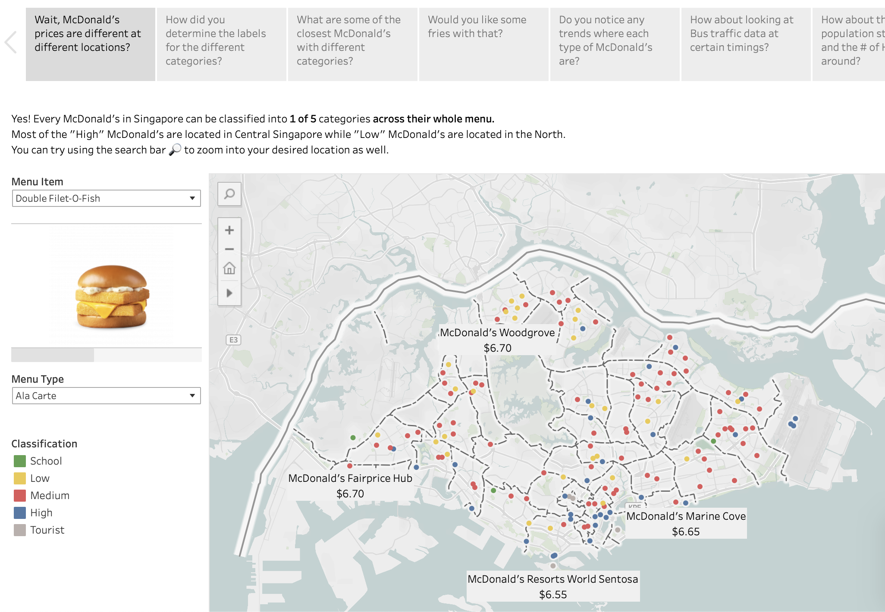

# McDonald's Pricing Prediction in Singapore

## Introduction

This project aims to predict McDonald's pricing across the entirety of Singapore using only location data. McDonald's prices their products [differently](https://nicslvl-mcpredictor-app-6qi9oo.streamlit.app) across the island. We hypothesize that there are economic reasons behind this strategy, which other F&B providers can potentially take reference from.

## Data
The main Python notebook mcd.ipynb consists of the following sections:

### Exploring McDonald's in Singapore
A brief introduction on the different prices and their distribution across the island. We identify 5 price types and some possible factors attributing to them.
### Getting Additional Data
Gathering additional location-specific data from various sources, including LTA, data.gov.sg, singstat, etc. This data will help form our predictions based on our hypothesis of McDonald's pricing their products based on supply and demand.
### EDA & Feature Engineering
Using all the raw data gathered in the previous section to create new features for each of the 144 McDonald's outlets. We started with only the latitude and longitude of each outlet, so every single feature is generated via the additional data from the previous section. This section also explores how we eventually pick our features using correlation.
### Modeling
In the Modeling section, we try a few classification models to model our features against our target variable "classification". The best performing model is the Random Forest, achieving a test accuracy score of 0.69 and a train accuracy of 0.73. Accuracy was chosen as our metric because our goal was to test our hypothesis that McDonald's classifications could be predicted, and thus every class was equally important.

To address the imbalanced data problem, we:
- Stratify the data during train-test split and k-folds cross-validation due to the imbalanced dataset
- Use balanced subsamples when training the Random Forest / Oversample using SMOTE for other classification techniques
Files

## Files
- mcd.ipynb: The main notebook used to explore our model and data
- graphics.twbx: The accompanying Tableau story for data visualization and dashboard
- my_functions.py: Custom functions built for feature engineering and the notebook
- app.py: Python file used for our Streamlit demo, available [here](https://nicslvl-mcpredictor-app-6qi9oo.streamlit.app)
- postal_codes.ipynb: A notebook used to predict random postal codes around Singapore based on our trained model
- random.ipynb: A notebook used for testing app.py before Streamlit deployment
- requirements.txt: Required Python libraries to run the code
- /pickles: Stored pickles used for app.py
- /images: Image files used for graphics.twbx
- /data: All the data used and output generated are stored in this folder
